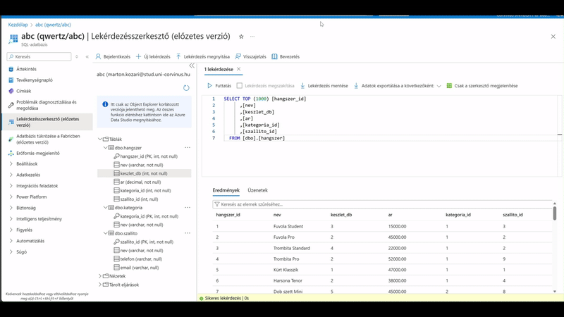
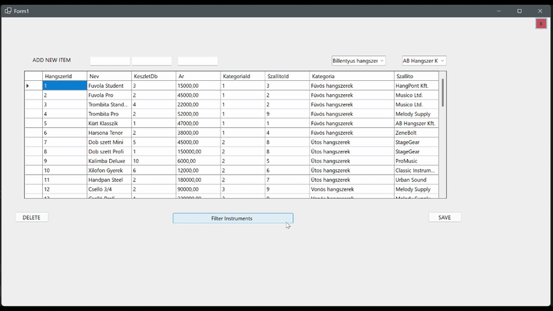
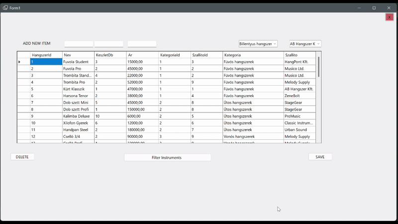
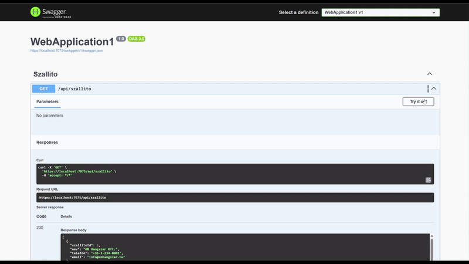
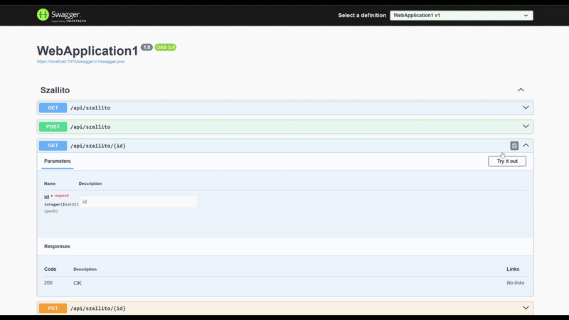
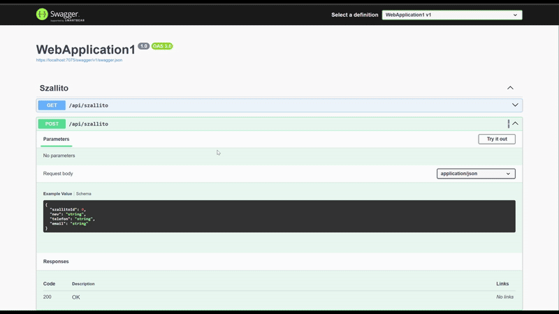
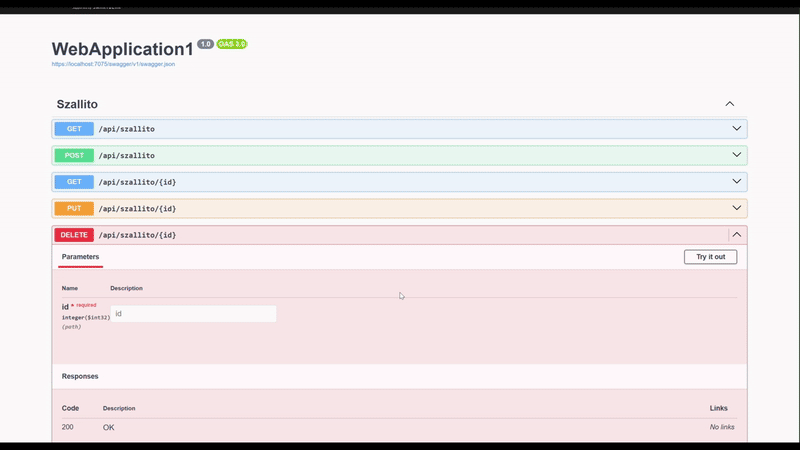

# Pontozólap
Név: Kedves Anita

Neptun: GXZMV8

## Projekt rövid leírása:
Az alkalmazás egy hangszer gyár raktárának kezelésére szolgál. Lehetőséget ad a hangszerek, szállitók és azok adatainak a nyilvántartására, módosítására.
Lehetőség van ezeket törölni, módosítani, feltölteni és átnevezni. A swagger felület a szállítók nyilvántartására, míg a Forms alkalmazás a hangszerekére készült.

## Hozott anyagok:
scaffold.txt

##### Saját Adatbázis

- `3x1p` Az alkalmazásban használt táblánk (Hangszer, Kategoria, Szallito)
- `1x1p` Az adatbázis tartalmaz Constraint-eket (min 2)
- `1x2p` Az adatbázis saját Azure SQL szerveren van
- `1x1p` Az adatbázis adatainak forrásmegjelölése, miből készült és hogyan:
>Az adatbázisra az órai feladatok és adatbázisokból kiindulva a raktározást láttam a legjobb kiinduló alapnak, ezt szerettem volna érdekesebbé téve egy hangszer raktár adatbázisát létrehozni. Azure Portalban létrehoztam az adatbázist, majd ehhez kapcsolódtam Visual Studio Code-ban, hogy létrehozzam a táblákat is. A mermaid kódot magam írtam, majd ez alapján  a beépített copilot segítségével megírattam az sql-t (ellenőriztem mindent  természetesen, amit kellett javítottam) és feltöltettem adattal is. 

Részösszeg: `7p`
Összesen: 7p

## Windows Forms Application

### User Interface
- `1x2p` Kilépés csak megerősítő kérdés után lehetséges.  
- `2x2p` Olyan alkalmazás elrendezés, melyben gombok lenyomására UserControl-ok kerülnek elhelyezésre egy Panel vezérlőben, teljesen kitöltve azt. (Instruments, Modify)

### Tábla adatainak megjelenítése ListBox-ban
- `1x2p` Adatok megjelenítése ListBox-ban
- `2x2p` Az adatok tetszőleges módszerrel,TextBox-on keresztül szűrhetőek.

### Tábla adatainak megjelenítése DataGridView-ban
- `1x2p` Adatok megjelenítése DGV-ben  

####User Interface , Datagridview és Tábla megjelenítése Listbox-ban.

### Adatkötés BindingSource-on keresztül
- `1x2p` Működő BindingSource  

### Új rekord rögzítése
- `1x2p` Master-detail reláció detail táblájába új rekord rögzítése (Products details "Kategoria","Szallito" táblák betöltése Include-al valósult meg)  
- `1x1p` Nem kulcs mező is felvéve (Ar, KeszletDb)  
- `1x2p` Ellenőrzéshez kötött adatfelvitel (String.IsNullOrEmpty stb.)
- `1x2p` Legördülő dobozon (ComboBox) keresztül beállítható idegen kulcs is 
- `1x2p` Felugró ablakon keresztül történik Ok és Mégse gombbal 
- `1x1p` Hibás kitöltés esetén nem lehet megynomni az Ok gombot. 
### Rekord törlése
- `1x2p` Sikeres törlés  
- `1x2p` Megerősítéshez kötött törlés  

####<Új rekord és rekord törlés>

### Egyéb, extra
- `2x1p` Scaffold-DbContext használata (ASP.Net és WIndows Forms)

Részösszeg: `32p`
Összesen: 39p

### ASP .NET 

##### API végpontok

- `1x3p` Teljes SQL tábla adatainak szolgáltatása API végponton keresztül
- `1x2p` SQL tábla egy választható rekordjának szolgáltatása API végponton keresztül (Products)
- `1x3p` SQL tábla egy választható rekordjának törlése
- `1x5p` Új rekord felvétele HttpPost metóduson keresztül SQL táblába

####<API Végpontok>

Megjelenítjük a lista összes adatát, a kulcsok helyére refferálunk a megfelelő Kategória és Szállító nevével.

Id keresés alapon bekérjük az id-t és kiírjuk a talált Termék adatait, amennyiben van ilyen id.

Új terméket viszünk fel validációval.

Id alapon törölhetjük egy termék teljes adatsorát.

Részösszeg: `13p`

## Összesen 52p

